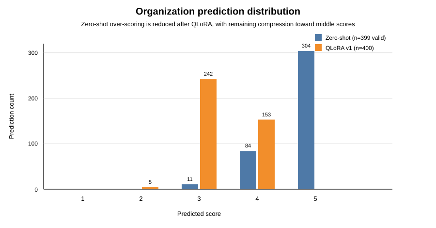

# Qwen3-4B + QLoRA 기반 한국어 논증문 자동 채점

[English README](README.md)

2026 **국립국어원 AI말평 글쓰기 채점 능력 평가**를 위해 개발한 Qwen3-4B 기반 한국어 논증문 자동 채점 프로젝트입니다.

주제와 논증문을 입력받아 **내용(Content), 구성(Organization), 표현(Expression)**을 각각 1–5점으로 평가하고, 각 점수에 대한 한국어 근거를 JSON 형식으로 생성합니다.

QLoRA 파인튜닝과 score-focused weighted token objective를 적용한 최종 모델은 validation에서 **RMSE 0.6384 / Spearman 0.5237**을 기록했습니다. 단순 평균 baseline의 RMSE는 **0.7870**, Qwen3-4B zero-shot은 **RMSE 1.1612 / Spearman 0.2753**이었습니다. 비공개 공식 test set에서는 **RMSE 0.6213 / Spearman 0.5697 / LLM Judge 3.0337**을 기록했습니다.

- **Base model:** `Qwen/Qwen3-4B-Instruct-2507`
- **Fine-tuning:** 4-bit NF4 QLoRA
- **Official test:** RMSE **0.6213** / Spearman **0.5697**
- **Hugging Face:** https://huggingface.co/slvrfivo/qwen3-4b-writing-eval-v1-merged

## 결과

| 모델 / 평가 | RMSE ↓ | Spearman ↑ | 비고 |
|---|---:|---:|---|
| 통계 평균 baseline | 0.7870 | undefined* | 반올림 후 모든 샘플에 동일한 점수 예측 |
| Qwen3-4B zero-shot | 1.1612 | 0.2753 | 400건 중 399건 valid |
| **Weighted QLoRA v1** | **0.6384** | **0.5237** | 최종 선택한 local checkpoint |
| Class-balanced QLoRA v1b | 0.6452 | 0.5189 | negative ablation |
| **공식 hidden test** | **0.6213** | **0.5697** | LLM Judge 3.0337 |

*통계 baseline은 공식 반올림 이후 예측값이 상수가 되므로 순위 분산이 0이고 Spearman 상관계수는 정의되지 않습니다.

공식 예선에서는 **53팀 중 49위**를 기록했고, 상위 50개 모델이 진출한 **AI말평 Arena 전문가 평가 단계**에서 **842점 / 50개 모델 중 44위**를 기록했습니다.

비공개 공식 test RMSE(**0.6213**)는 local validation RMSE(**0.6384**)보다 소폭 낮았습니다. 이는 held-out 대회 데이터에서도 성능이 유지되었다는 긍정적인 신호지만, split과 평가 조건이 다르므로 **과적합이 없었다는 증거로 해석하지는 않습니다.**

최종 결과 요약은 [reports/final_results.md](reports/final_results.md), 상세 실험 기록은 [reports/experiments.md](reports/experiments.md)에 정리했습니다.

## 문제 설정

입력은 글쓰기 주제와 한국어 논증문으로 구성됩니다. 모델은 세 영역의 점수와 근거를 하나의 JSON 객체로 생성합니다.

~~~json
{
  "content": {
    "score": 4,
    "rationale": "주장과 근거가 주제에 맞게 제시되어 있으나 일부 근거의 구체성이 부족하다."
  },
  "organization": {
    "score": 3,
    "rationale": "전체적인 구조는 갖추고 있지만 문단 간 연결이 다소 자연스럽지 않다."
  },
  "expression": {
    "score": 4,
    "rationale": "대체로 적절한 어휘와 문장을 사용했으나 일부 표현이 반복된다."
  }
}
~~~

## 접근 방법

### 1. 공식 평가 로직 재현

`src/evaluate.py`에서 대회의 정량 평가 규칙을 로컬에 재현했습니다.

- 예측 JSON 구조 검증
- 1–5 범위 확인
- `ROUND_HALF_UP` 방식 반올림
- Content / Organization / Expression별 RMSE와 Spearman 계산
- 동점 순위에 평균 순위 적용

이를 먼저 구현해 이후 모든 실험을 동일한 평가 기준으로 비교했습니다.

### 2. Qwen3-4B zero-shot baseline

`Qwen/Qwen3-4B-Instruct-2507`을 NF4 4-bit로 로드하고 공식 prompt로 zero-shot 추론을 수행했습니다.

- Mean RMSE: **1.1612**
- Mean Spearman: **0.2753**
- Strict JSON parse: **399 / 400**

특히 Organization 영역에서 점수를 과도하게 높게 예측하는 calibration 문제가 컸고, 이를 바탕으로 supervised adaptation을 진행했습니다.

### 3. QLoRA 파인튜닝

약 9.5 GiB VRAM의 NVIDIA A100 MIG 환경에서 full fine-tuning 대신 QLoRA를 사용했습니다.

주요 설정:

- NF4 4-bit quantization
- BF16 compute
- LoRA `r=16`, `alpha=32`, `dropout=0.05`
- all-linear target modules
- 1 epoch
- learning rate `5e-5`
- effective batch size 8
- max sequence length 2048

전체 설정은 [configs/qwen3_4b_qlora_v1.json](configs/qwen3_4b_qlora_v1.json)에서 확인할 수 있습니다.

### Organization 예측 분포 변화

Zero-shot에서는 Organization을 **399건 중 304건에서 5점**으로 예측했습니다. QLoRA 이후에는 3점과 4점 예측이 각각 **242건 / 153건**으로 이동해 과대평가는 크게 줄었지만, 반대로 중간 점수로 수렴하는 경향이 남았습니다.

## Score-focused Weighted Token Objective

일반적인 causal language-model loss는 supervised output token을 비슷한 중요도로 다룹니다. 하지만 이 대회에서는 **점수 토큰의 오류가 RMSE와 Spearman에 직접 영향을 주기 때문에**, target token을 역할별로 구분해 서로 다른 loss weight를 적용했습니다.

| Token 역할 | Loss weight |
|---|---:|
| Prompt | 0.00 |
| JSON structure | 0.25 |
| **Score** | **10.00** |
| Rationale | 0.05 |

~~~text
weighted loss = Σ(token loss × token weight) / Σ(token weight)
~~~

이 값들은 systematic hyperparameter search로 선택한 것이 아니라 **대회 목적에 맞게 heuristic하게 설정한 값**입니다.

구현 위치:

- `src/qlora/tokenization.py`
- `src/qlora/loss.py`
- `src/qlora/training.py`

> 동일한 설정에서 모든 token weight를 1로 둔 uniform-loss QLoRA 실험은 수행하지 않았습니다. 따라서 zero-shot 및 통계 baseline 대비 개선을 weighted objective 단독의 효과로 해석하지 않고, **전체 QLoRA fine-tuning setup의 결과**로 봅니다.

## Class-balanced Ablation

v1 모델은 예측이 주로 3점과 4점에 집중되는 문제가 남아 있었습니다. 이를 줄이기 위해 train label 분포를 기반으로 score token에 class-dependent weight를 추가한 v1b를 실험했습니다.

| 모델 | RMSE ↓ | Spearman ↑ |
|---|---:|---:|
| **Weighted QLoRA v1** | **0.6384** | **0.5237** |
| Class-balanced QLoRA v1b | 0.6452 | 0.5189 |

v1b에서는 극단 점수 예측은 늘었지만 전체 RMSE와 Spearman이 소폭 악화되어, 최종 모델은 v1을 유지했습니다.

## 회고: 점수 정확도와 rationale 품질의 trade-off

학습 objective에서는 score token에 **10.0**, rationale token에 **0.05**의 가중치를 두었고, rationale target 역시 rubric template 중심으로 구성했습니다. 실제 실험 로그에서도 fine-tuning 이후 rationale이 더 단순하고 템플릿에 가까워졌다고 기록했습니다.

따라서 이 프로젝트에서는 정량 점수 지표를 개선하는 방향과 근거 설명의 풍부함 사이에 trade-off가 있었을 가능성이 있습니다. 공식 **LLM Judge 3.0337**과 rationale을 포함한 출력을 전문가가 비교한 Arena 결과는 이 해석과 **일관되지만**, rationale 가중치가 최종 순위의 직접 원인이었다고 입증하는 실험은 없습니다.

다시 진행한다면 uniform-loss baseline과 rationale weight sweep을 추가하고, 더 풍부한 rationale target을 사용하며, score prediction과 explanation generation을 두 단계로 분리하는 방법도 비교하겠습니다. 또한 RMSE/Spearman뿐 아니라 rationale 품질 지표도 model selection 기준에 포함하겠습니다.

## 모델 Export 및 Serving

최종 PEFT adapter는 pinned BF16 base model에 merge해 standalone Hugging Face 모델로 export했습니다.

Export 과정에서는 다음을 확인합니다.

**merge → local reload → model/tokenizer invariant check → strict JSON smoke test**

최종 제출 테스트 과정에서 일부 입력에 반복 생성 문제가 발생해 Hugging Face artifact의 `generation_config.json`에 다음 설정을 적용했습니다.

~~~json
{
  "repetition_penalty": 1.05
}
~~~

이 제출 시점 설정은 [configs/submission_generation.json](configs/submission_generation.json)에 남겨두었고, BF16 export CLI가 이 파일을 읽어 export된 Hugging Face `generation_config.json`에 자동으로 적용하도록 연결했습니다.

최종 모델은 vLLM OpenAI-compatible serving 환경에서도 검증했습니다. Hugging Face 모델 카드 초안은 [docs/huggingface_model_card.md](docs/huggingface_model_card.md)에 정리했습니다.

## 재현

학습 환경과 세부 재현 방법은 [docs/reproducibility.md](docs/reproducibility.md)에 정리되어 있습니다.

~~~bash
pip install -r requirements-train-gpu.txt

python src/train_qlora.py \
  --input data/raw/train.jsonl \
  --output-dir checkpoints/qwen3_4b_qlora_v1 \
  --config configs/qwen3_4b_qlora_v1.json

python src/zero_shot.py \
  --input data/raw/validation.jsonl \
  --output-dir outputs/qlora_v1 \
  --adapter checkpoints/qwen3_4b_qlora_v1/final_adapter

python src/evaluate.py \
  --predictions outputs/qlora_v1/predictions.jsonl \
  --require-rationale
~~~

## 테스트

GitHub Actions에서 pull request와 `master` push마다 CPU unit test를 실행합니다. 현재 테스트는 **85개**입니다.

~~~bash
python -m unittest discover -s tests -v
~~~

## 한계

- 학습 데이터는 2,000건입니다.
- v1에서도 예측이 중간 점수로 수렴하는 경향이 남아 있습니다.
- 1점과 5점은 3점과 4점보다 예측하기 어렵습니다.
- uniform-loss QLoRA ablation을 수행하지 않아 weighted token loss의 독립적인 기여도는 분리하지 못했습니다.
- class balancing은 극단 점수 예측을 늘렸지만 전체 validation 성능은 악화시켰습니다.
- local validation은 RMSE와 Spearman을 재현하지만 공식 LLM Judge는 재현하지 않습니다.
- 대회 prompt, domain, rubric 밖에서의 성능은 검증하지 않았습니다.

## 데이터 및 라이선스

대회 데이터는 이 저장소에서 재배포하지 않습니다. 데이터, checkpoint, 생성 결과, 모델 weight는 `.gitignore`를 통해 제외합니다.

프로젝트 코드는 Apache License 2.0으로 공개합니다. 외부 모델, 대회 데이터, 공식 자료에는 각각의 라이선스 및 이용 조건이 적용됩니다.
